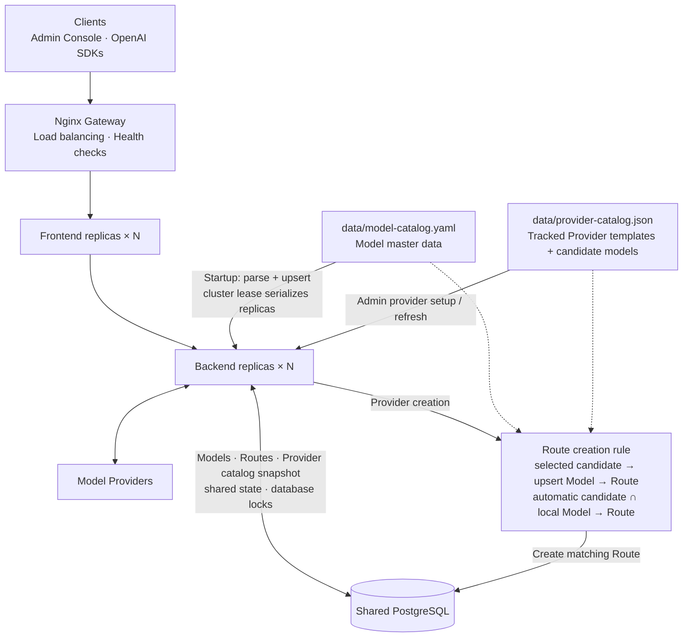

# Deployment

Language: English | [简体中文](zh-CN/deployment.md) | [日本語](ja/deployment.md)

TokenHub is designed for private deployment with a Go backend, a Next.js admin console, and support for SQLite or PostgreSQL persistence.

## Database Selection

TokenHub supports two database backends:

### SQLite (Default)

**Advantages:**
- Zero configuration, no separate database service required
- Suitable for small to medium deployments
- Simple backups (direct file copy)

**Use cases:**
- Development and testing environments
- Deployments with fewer than 1000 users
- Single-server deployments

**Deployment:**

```bash
docker compose --env-file deploy/.env -f deploy/docker-compose.yml up -d --remove-orphans
```

### PostgreSQL (Production Recommended)

**Advantages:**
- Enterprise-grade database for high concurrency scenarios
- Better transaction support and data integrity
- Supports replication and high availability

**Use cases:**
- Production environments
- Deployments with more than 1000 users
- High-availability requirements

**Deployment:**

```bash
docker compose --env-file deploy/.env -f deploy/docker-compose.postgres.yml up -d --remove-orphans
```

For detailed PostgreSQL configuration, see the [PostgreSQL Setup Guide](postgresql-setup.md).

### Multi-instance deployment with remote PostgreSQL

The default installation starts one frontend and one backend with SQLite. For horizontal scaling with PostgreSQL managed outside this Compose project, use `deploy/docker-compose.remote-postgres.yml`. It adds an Nginx gateway in front of scalable backend and frontend services and does not start a local database.



In multi-instance mode:

- Nginx load-balances console, API, and health-check traffic across healthy replicas.
- Backend replicas keep durable configuration, OAuth sessions, quota buckets, audit data, cluster locks, and in-flight concurrency leases in PostgreSQL.
- Lease expiry and ownership decisions use the PostgreSQL clock, avoiding early takeover caused by clock skew between hosts. Heartbeats cancel work when lease ownership is lost.
- The configured model catalog is synchronized on every backend startup; a cluster lease serializes the idempotent synchronization across replicas.
- Provider templates and candidate models are read from the tracked local provider catalog; runtime configuration does not depend on a remote catalog service.
- The backend persists a local Provider-catalog snapshot in PostgreSQL, so replicas serve the same catalog and a missing local file falls back to the seeded built-in templates.
- Coordination failures release provider capacity without incorrectly marking a healthy model provider as failed.

Set the remote `TOKENHUB_DATABASE_URL`, public gateway URL, production secrets, and trusted proxy CIDR, then run:

```bash
docker compose --env-file deploy/.env \
  -f deploy/docker-compose.remote-postgres.yml up -d \
  --scale tokenhub-backend=3 \
  --scale tokenhub-frontend=2
```

All replicas must use the same `TOKENHUB_SECRET_KEY`. Size `TOKENHUB_DB_MAX_OPEN_CONNS` per replica so the combined pool remains below the PostgreSQL connection limit. Never share a SQLite file between backend replicas.

Run the real two-instance PostgreSQL E2E suite with `./deploy/test-multi-instance.sh`.

## Native Release with systemd

Use the native Release installer for a single Linux host with systemd. Native packages support `linux/amd64` and `linux/arm64`, and bundle the Go backend, the standalone Next.js console, and a matching Node.js runtime.

Download and inspect the installer, then install the latest stable Release:

```bash
curl -fsSL https://raw.githubusercontent.com/astaxie/TokenHub/main/deploy/native/install.sh \
  -o /tmp/tokenhub-install.sh
sudo bash /tmp/tokenhub-install.sh install
```

Set `TOKENHUB_PUBLIC_HOST` when the server's first detected IP is not the address users will open:

```bash
sudo env TOKENHUB_PUBLIC_HOST=tokenhub.example.com \
  bash /tmp/tokenhub-install.sh install
```

The first installation generates production secrets and an initial admin password. The password is printed once. Runtime files are kept in separate locations:

- Releases and the `current` symlink: `/opt/tokenhub`
- Configuration and secrets: `/etc/tokenhub/tokenhub.env`
- SQLite database and backups: `/var/lib/tokenhub`
- Linux systemd unit: `/etc/systemd/system/tokenhub.service`

Edit `/etc/tokenhub/tokenhub.env` when changing public URLs, CORS origins, ports, database settings, or secrets, then restart the service:

```bash
sudo systemctl restart tokenhub
sudo systemctl status tokenhub
sudo journalctl -u tokenhub -f
```

The installer verifies the Release archive against `checksums.txt` before activation and preserves configuration and data during upgrades:

```bash
sudo bash /tmp/tokenhub-install.sh upgrade
sudo bash /tmp/tokenhub-install.sh upgrade --version 0.3.3
sudo bash /tmp/tokenhub-install.sh rollback --version 0.3.2
sudo bash /tmp/tokenhub-install.sh uninstall
```

`uninstall` preserves `/etc/tokenhub` and `/var/lib/tokenhub`. Use `uninstall --purge` only when configuration and application data should also be deleted.

For a fork, use its installer URL and tell TokenHub which public Release repository to query:

```bash
sudo env TOKENHUB_RELEASE_REPOSITORY=your-account/TokenHub \
  bash /tmp/tokenhub-install.sh install --version 0.3.3
```

Native Release installations are labeled `Native Release` in the version panel. Administrators can download and verify an update or rollback directly from the panel, then select **Restart now** to activate it through systemd. Each GitHub Release must contain the Linux archive and `checksums.txt`; `.github/workflows/native-release.yml` builds and attaches the `linux/amd64` and `linux/arm64` assets when a Release is published.

## Docker Compose

Create a deployment environment file:

```bash
cp deploy/.env.example deploy/.env
```

Edit `deploy/.env` before starting:

- `TOKENHUB_ADMIN_TOKEN`: Admin API bootstrap token. Use a random value of at least 32 bytes.
- `TOKENHUB_BOOTSTRAP_ADMIN_PASSWORD`: Password used only when creating the initial `admin` user. Use at least 12 bytes.
- `TOKENHUB_SECRET_KEY`: Backend secret key. Use a random value of at least 32 bytes and keep it stable.
- `TOKENHUB_IMAGE_TAG`: Managed TokenHub image tag. Default: `latest`.
- `TOKENHUB_PUBLIC_BASE_URL`: Public backend URL shown to users.
- `TOKENHUB_API_BASE_URL`: Backend URL used by the browser admin console. The frontend server reads it at runtime. The deprecated `NEXT_PUBLIC_API_BASE_URL` remains a fallback for one compatibility cycle.
- `TOKENHUB_BACKEND_PORT`: Host port for the backend. Default: `8080`.
- `TOKENHUB_FRONTEND_PORT`: Host port for the admin console. Default: `3000`.

Start the stack from the repository root:

```bash
./deploy/install.sh
```

The script validates the Compose environment, pulls the published image, and starts the managed application container without building locally. It also removes the obsolete standalone frontend container when upgrading from the former two-container layout; the `tokenhub-data` volume is preserved. If the image cannot be pulled during the initial GHCR rollout, it falls back to building from the local checkout. Validation errors name every unsafe variable without printing their values. If Compose fails and the application container created or restarted by that attempt is exited, restarting, dead, or unhealthy, the script prints up to 100 log lines from that attempt.

Validate without pulling or starting containers:

```bash
./deploy/install.sh --check-only
```

Use a different environment file with `./deploy/install.sh --env-file /path/to/deploy.env`.

### Published image lifecycle

GitHub Actions publishes the complete `ghcr.io/astaxie/tokenhub-backend` image for `linux/amd64` and `linux/arm64`. Despite the compatibility-preserving image name, it contains the backend, standalone Next.js console, Node.js runtime, and the container supervisor.

- Publishing a GitHub Release builds the exact semantic-version tag. A non-prerelease also updates the major-minor tag and `latest`.
- `workflow_dispatch` can publish `edge` or an isolated `manual-*` tag. It cannot overwrite release or `latest` tags.
- Pull requests do not build or push container images.
- Merges to `main` do not publish images.

The image is first pushed under a run-specific staging tag and verified before the workflow promotes it to the requested release tags. For reproducible production deployments, pin an exact release tag instead of relying on `latest`.

The first GHCR publication creates a private package. The repository owner must make it public before anonymous deployments can pull it. Until then, a deployment using the default `latest` tag remains usable by automatically falling back to a local source build. If an explicit `TOKENHUB_IMAGE_TAG` cannot be pulled, the installer exits instead of labeling current source as that version.

### Docker version status and rollback

Platform administrators can select the version badge below the TokenHub logo to inspect the running version, check the latest stable GitHub Release, and list up to three older stable releases. Release builds receive their exact version from the publication workflow; local source builds use the package version and are labeled as source builds.

The check makes a time-limited outbound HTTPS request to the public GitHub Releases API and caches successful results for 20 minutes. It checks `astaxie/TokenHub` by default. Maintainers can set `TOKENHUB_RELEASE_REPOSITORY` to another trusted public `owner/repository` when validating releases from a fork. A GitHub outage or a repository without releases does not affect gateway traffic. The panel reports the unavailable state and keeps the current version visible.

For example, check a fork while running from source:

```bash
TOKENHUB_RELEASE_REPOSITORY=your-account/TokenHub ./start.sh
```

The default SQLite and local PostgreSQL Compose files run a single managed application container. An administrator can select **Update now**, wait for the checksummed platform Release bundle to be installed under the `tokenhub-releases` volume, and then select **Restart now**. The process exits after responding; Docker's `restart: unless-stopped` policy starts the selected backend and frontend together. The container never mounts the Docker socket or controls the host daemon.

The image version is the baseline when a newly pulled image first uses the volume. Panel-applied updates survive ordinary restarts and container recreation with the same image because `current` and all installed Release bundles are stored in `tokenhub-releases`. Pulling a different image tag intentionally makes that image version the new baseline. The remote PostgreSQL multi-instance Compose file disables in-place updates because changing only the replica that receives an admin request would split the cluster; its panel continues to provide operator-run Compose commands. Source deployments continue to show manual guidance. Before rollback, create a database backup and confirm that the target release supports the current schema.

### Optional local build

Build from the current checkout instead of pulling published images:

```bash
./deploy/install.sh --build
```

The following acceleration settings apply only to local source builds.

The project Dockerfiles do not hard-code regional package mirrors. If your server has slow access to Docker Hub, npm, or Go module sources, configure acceleration on the deployment host instead of editing Dockerfiles.

For Docker base image pulls, configure Docker daemon registry mirrors on the server, for example in `/etc/docker/daemon.json`, then restart Docker:

```json
{
	"registry-mirrors": [
		"https://<your-docker-registry-mirror>"
	]
}
```

For dependency downloads during image builds, prefer configuring an outbound HTTP/HTTPS proxy for Docker or BuildKit on the server. This keeps builds portable and avoids committing environment-specific npm or Go proxy settings to the repository.

If you deploy in an environment where direct access to upstream registries is slow, the following server-side examples can be used as references:

```bash
# Go module downloads
go env -w GOPROXY=https://goproxy.cn,direct

# npm package downloads
npm config set registry https://registry.npmmirror.com
```

These commands configure the server or build environment. Do not add them directly to project Dockerfiles unless you intentionally maintain an environment-specific fork.

The compose file starts:

- Backend on `http://localhost:8080`
- Frontend on `http://localhost:3000`
- SQLite data stored in the named Docker volume `tokenhub-data`
- Model catalog included in the selected backend image

Check status:

```bash
docker compose --env-file deploy/.env -f deploy/docker-compose.yml ps
```

Initial admin login:

- Username: `admin`
- Password: the configured `TOKENHUB_BOOTSTRAP_ADMIN_PASSWORD`

For `prod`, `production`, staging, and other non-development environments, startup rejects placeholder values, admin tokens or secret keys shorter than 32 bytes, and bootstrap passwords shorter than 12 bytes.

View or follow logs manually:

```bash
docker compose --env-file deploy/.env -f deploy/docker-compose.yml logs -f
```

Stop:

```bash
docker compose --env-file deploy/.env -f deploy/docker-compose.yml down
```

Stop and remove the SQLite data volume:

```bash
docker compose --env-file deploy/.env -f deploy/docker-compose.yml down -v
```

Only use `down -v` when you intentionally want to delete local data.

## Backend Environment Variables

| Variable | Default | Description |
| --- | --- | --- |
| `TOKENHUB_ENV` | `prod` | Runtime environment label |
| `TOKENHUB_HTTP_ADDR` | `:8080` | Backend listen address |
| `TOKENHUB_PUBLIC_BASE_URL` | `http://localhost:8080` | Public backend URL shown to users |
| `TOKENHUB_RELEASE_REPOSITORY` | `astaxie/TokenHub` | Trusted public GitHub repository used for version checks, in `owner/repository` form |
| `TOKENHUB_INSTALL_ROOT` | `/opt/tokenhub` | Managed Release installation root used for online update and rollback |
| `TOKENHUB_TRUSTED_PROXY_CIDRS` | empty | Comma-separated proxy IPs or CIDRs allowed to supply `X-Forwarded-For` |
| `TOKENHUB_CORS_ALLOWED_ORIGINS` | public URL | Comma-separated browser origins allowed to call the backend |
| `TOKENHUB_ADMIN_TOKEN` | `change-me-tokenhub-admin-token` | Bootstrap admin token for Admin API access |
| `TOKENHUB_BOOTSTRAP_ADMIN_PASSWORD` | `change-me-tokenhub-admin-password` | Password for the initial `admin` user; must be changed before production startup |
| `TOKENHUB_SECRET_KEY` | `change-me-tokenhub-secret-key` | Backend secret key |
| `TOKENHUB_DATABASE_URL` | `sqlite:///app/data/tokenhub.db` | Database connection URL (sqlite:// or postgresql://) |
| `TOKENHUB_SQLITE_BACKUP_DIR` | `/app/data/backups` | Backup output directory |
| `TOKENHUB_MODEL_CATALOG_FILE` | `/opt/tokenhub/current/catalog/model-catalog.yaml` | Standard model catalog file in managed deployments |
| `TOKENHUB_PROVIDER_CATALOG_FILE` | `/opt/tokenhub/current/catalog/provider-catalog.json` | Provider templates and candidate-model catalog file in managed deployments |
| `TOKENHUB_SEED_DEMO` | `false` | Whether to seed demo data |
| `TOKENHUB_LOG_LEVEL` | `info` | Log level |
| `TOKENHUB_RESOURCE_FAILURE_THRESHOLD` | `3` | Provider resource failure threshold before cooldown |
| `TOKENHUB_RESOURCE_COOLDOWN_SECONDS` | `300` | Base cooldown before a parked provider resource is given a half-open retry |
| `TOKENHUB_RESOURCE_COOLDOWN_MAX_SECONDS` | `3600` | Upper bound for the exponential backoff applied to repeated recovery failures |
| `TOKENHUB_METRICS_ENABLED` | `false` | Collect Prometheus metrics and serve `GET /metrics` |
| `TOKENHUB_METRICS_TOKEN` | empty | Bearer token for `/metrics`; falls back to the admin token when empty |
| `TOKENHUB_METRICS_PROJECT_LABEL` | `false` | Add `project_id` to gateway metrics; raises series count by the project count |
| `TOKENHUB_IN_FLIGHT_LEASE_TTL_SECONDS` | `300` | Expiry and renewal basis for cluster-wide concurrency leases |
| `TOKENHUB_CLUSTER_LOCK_TTL_SECONDS` | `180` | Expiry and renewal basis for cluster coordination locks |
| `TOKENHUB_GRACEFUL_SHUTDOWN_SECONDS` | `150` | Maximum time to drain in-flight requests during shutdown |
| `TOKENHUB_STOP_GRACE_PERIOD` | `180s` | Compose grace period before Docker force-stops the backend |
| `TOKENHUB_CACHE_AFFINITY_ENABLED` | `false` | Pin a session to one upstream account so the provider's prompt cache keeps hitting. Off by default because it changes routing behaviour |
| `TOKENHUB_CACHE_AFFINITY_MODELS` | empty | Comma-separated model allowlist for staged rollout; empty means every model |
| `TOKENHUB_CACHE_AFFINITY_ALLOW_USER_SCOPE` | `false` | Also accept user-scoped identifiers as affinity keys; off by default because one user's concurrent sessions would share a single account |
| `TOKENHUB_DB_MAX_OPEN_CONNS` | `25` | Maximum open database connections (PostgreSQL only) |
| `TOKENHUB_DB_MAX_IDLE_CONNS` | `5` | Maximum idle database connections (PostgreSQL only) |
| `TOKENHUB_DB_CONN_MAX_LIFETIME_MINUTES` | `30` | Maximum connection lifetime in minutes (PostgreSQL only) |

## Frontend Environment Variables

| Variable | Default | Description |
| --- | --- | --- |
| `TOKENHUB_API_BASE_URL` | `http://localhost:8080` | Backend Admin API URL read by the frontend server at runtime |
| `NEXT_PUBLIC_API_BASE_URL` | empty | Deprecated compatibility fallback; migrate to `TOKENHUB_API_BASE_URL` |

## Data and Backups

SQLite is the persistent source for projects, keys, Providers, routes, users, request logs, usage, alerts, approvals, sessions, and backup records.

In the one-command compose deployment:

- Database path inside the backend container: `/app/data/tokenhub.db`
- Backup path inside the backend container: `/app/data/backups`
- Docker volume name: `tokenhub-data`

Recommended production setup:

- Store the SQLite database on a persistent disk.
- Store backups outside the application container.
- Rotate old backups according to your retention policy.
- Keep provider credentials and admin tokens in a secret manager or protected environment variables.

## Catalog Files

Published managed images and native archives include matching copies of `data/model-catalog.yaml` and `data/provider-catalog.json`. They are activated with the rest of the release under `/opt/tokenhub/current/catalog/`, so the backend binary and both catalogs always come from the same version. The Provider catalog is vendored from PublicProviderConf and is read locally at runtime; TokenHub does not fetch remote catalog data.

To mount a custom catalog explicitly:

```bash
./deploy/install.sh --model-catalog /absolute/path/to/model-catalog.yaml
```

After editing the configured catalog file, restart the backend or use **Restore Factory Catalog** in the admin Model Catalog page to re-import the current file without removing manually added models.

The custom mount intentionally overrides the image catalog and is therefore managed separately from `TOKENHUB_IMAGE_TAG`. After updating that file, restart the backend container and confirm the entries in `Model Catalog`.

`data/model-catalog.yaml` remains the model master data and route allowlist. `data/provider-catalog.json` provides Provider templates and candidate models. Automatic route creation only uses candidates already present in the model catalog; when an administrator explicitly enables a candidate during Provider creation, TokenHub adds it to the model catalog before creating its route. To use a custom Provider catalog, set `TOKENHUB_PROVIDER_CATALOG_FILE` to a local JSON file using the same `providers` structure.

## Reverse Proxy

For production, place TokenHub behind HTTPS and forward:

- Admin console traffic to the frontend service.
- `/v1/*` and `/api/admin/*` traffic to the backend service.

Set request body and streaming timeouts high enough for long model responses.

Use `/livez` for liveness and `/readyz` for readiness. `/readyz` and the backwards-compatible `/healthz` return `503` when the database is unavailable.
