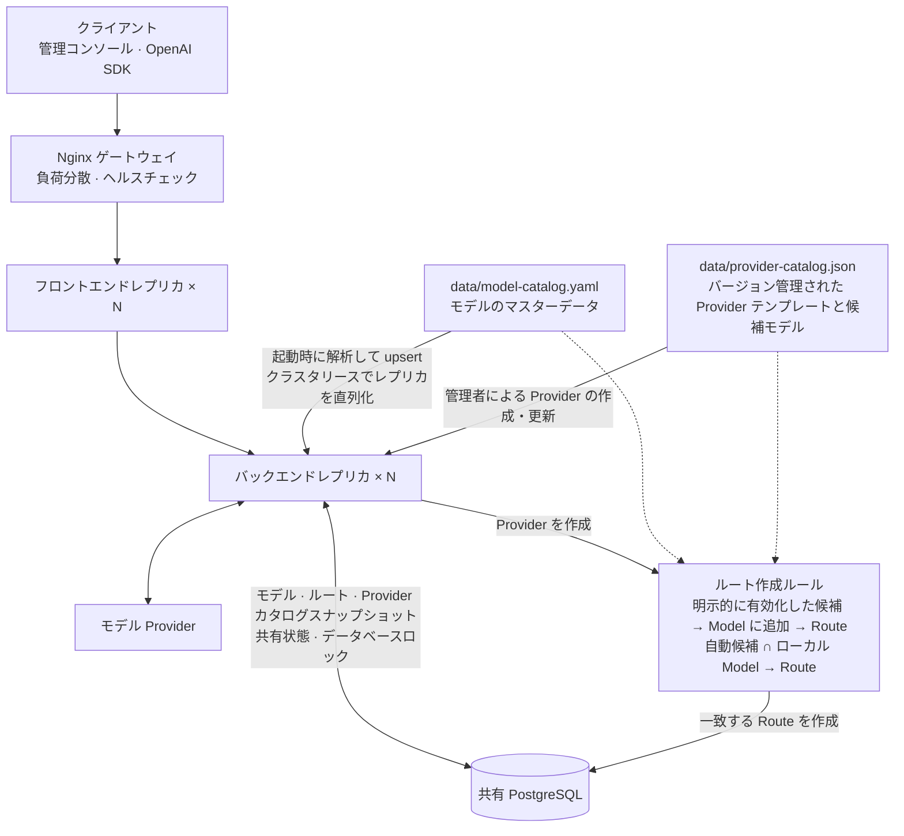

# デプロイ

Language: [English](../deployment.md) | [简体中文](../zh-CN/deployment.md) | 日本語

TokenHub は、Go バックエンド、Next.js 管理コンソール、SQLite 永続化で構成されるプライベートデプロイ向けのサービスです。

## データベースの選択

TokenHub は 2 種類のデータベースバックエンドをサポートしています。

### SQLite（デフォルト）

**利点：**
- 設定不要で、別途データベースサービスが不要
- 中小規模のデプロイに適する
- バックアップが簡単（ファイルを直接コピー）

**ユースケース：**
- 開発およびテスト環境
- 1000 ユーザー未満のデプロイ
- 単一サーバーのデプロイ

**デプロイ：**

```bash
docker compose --env-file deploy/.env -f deploy/docker-compose.yml up -d --remove-orphans
```

### PostgreSQL（本番環境推奨）

**利点：**
- 高並行シナリオに適したエンタープライズ級データベース
- より優れたトランザクションサポートとデータ整合性
- レプリケーションと高可用性をサポート

**ユースケース：**
- 本番環境
- 1000 ユーザーを超えるデプロイ
- 高可用性要件

**デプロイ：**

```bash
docker compose --env-file deploy/.env -f deploy/docker-compose.postgres.yml up -d --remove-orphans
```

PostgreSQL の詳細な設定については、[PostgreSQL セットアップガイド](../postgresql-setup.md)を参照してください。

### リモート PostgreSQL を使用するマルチインスタンス構成

デフォルトのインストールでは、SQLite を使用するフロントエンド 1 台とバックエンド 1 台を起動します。水平スケールが必要で、データベースを Compose プロジェクト外で管理する場合は `deploy/docker-compose.remote-postgres.yml` を使用します。この構成はスケール可能なバックエンドとフロントエンドの前に Nginx ゲートウェイを配置し、ローカルデータベースを起動しません。



マルチインスタンスモードでは：

- Nginx が管理コンソール、API、ヘルスチェックのトラフィックを正常なレプリカへ分散します。
- バックエンドレプリカは、永続設定、OAuth セッション、クォータカウンター、監査データ、クラスターロック、実行中リクエストの並行数リースを PostgreSQL で共有します。
- リースの期限と所有権は PostgreSQL のクロックで判定し、ホスト間の時刻ずれによる早期引き継ぎを防ぎます。所有権を失った処理はハートビートによってキャンセルされます。
- 設定されたモデルカタログはバックエンドの起動ごとに同期され、冪等な同期処理はクラスターロックによって直列化されます。
- Provider テンプレートと候補モデルは、リポジトリでバージョン管理されたローカルカタログから読み込まれ、実行時にリモートカタログサービスへ依存しません。
- バックエンドはローカル Provider カタログのスナップショットを PostgreSQL に永続化するため、全レプリカで同じカタログを使用できます。ローカルファイルがない場合は、データベースへ保存された組み込みテンプレートにフォールバックします。
- データベースの調整障害では Provider の容量だけを解放し、正常なモデル Provider を誤って失敗扱いにしません。

リモート `TOKENHUB_DATABASE_URL`、公開ゲートウェイ URL、本番用シークレット、信頼するプロキシ CIDR を設定して実行します。

```bash
docker compose --env-file deploy/.env \
  -f deploy/docker-compose.remote-postgres.yml up -d \
  --scale tokenhub-backend=3 \
  --scale tokenhub-frontend=2
```

すべてのレプリカで同じ `TOKENHUB_SECRET_KEY` を使用してください。`TOKENHUB_DB_MAX_OPEN_CONNS` はレプリカ単位なので、合計接続数が PostgreSQL の上限を下回るように設定します。SQLite ファイルを複数のバックエンドで共有してはいけません。

`./deploy/test-multi-instance.sh` で実際の 2 インスタンス PostgreSQL E2E テストを実行できます。

## ネイティブ Release + systemd/launchd

systemd を使用する単一 Linux ホスト、または launchd を使用する macOS ホストでは、ネイティブ Release インストールを利用できます。ネイティブパッケージは `linux/amd64`、`linux/arm64`、`darwin/amd64`、`darwin/arm64` に対応し、Go バックエンド、スタンドアロン Next.js コンソール、対応する Node.js ランタイムを含みます。

インストーラーをダウンロードして内容を確認し、最新の安定版 Release をインストールします。

```bash
curl -fsSL https://raw.githubusercontent.com/wangle201210/TokenHub/main/deploy/native/install.sh \
  -o /tmp/tokenhub-install.sh
sudo bash /tmp/tokenhub-install.sh install
```

サーバーが自動検出する最初の IP が実際のアクセス先でない場合は、`TOKENHUB_PUBLIC_HOST` を設定します。

```bash
sudo env TOKENHUB_PUBLIC_HOST=tokenhub.example.com \
  bash /tmp/tokenhub-install.sh install
```

初回インストールでは、本番用シークレットと初期管理者パスワードが生成されます。パスワードは一度だけ表示されます。実行ファイルは次の場所に分けて保存されます。

- Release と `current` シンボリックリンク: `/opt/tokenhub`
- 設定とシークレット: `/etc/tokenhub/tokenhub.env`
- SQLite データベースとバックアップ: `/var/lib/tokenhub`
- Linux systemd ユニット: `/etc/systemd/system/tokenhub.service`
- macOS LaunchDaemon: `/Library/LaunchDaemons/org.tokenhub.tokenhub.plist`

macOS では `sudo` でインストーラーを実行してください。launchd は、デフォルトで `sudo` を実行したログインユーザーとして TokenHub を起動します。別の既存ローカルアカウントを使用する場合のみ `TOKENHUB_SERVICE_USER` を設定します。

公開 URL、CORS Origin、ポート、データベース、シークレットを変更する場合は `/etc/tokenhub/tokenhub.env` を編集して、サービスを再起動します。Linux では次を使用します。

```bash
sudo systemctl restart tokenhub
sudo systemctl status tokenhub
sudo journalctl -u tokenhub -f
```

macOS では次を使用します。

```bash
sudo launchctl kickstart -k system/org.tokenhub.tokenhub
sudo launchctl print system/org.tokenhub.tokenhub
tail -f /var/lib/tokenhub/tokenhub.log /var/lib/tokenhub/tokenhub-error.log
```

インストーラーは、Release アーカイブを `checksums.txt` で検証してから有効化し、アップグレード時も設定とデータを保持します。

```bash
sudo bash /tmp/tokenhub-install.sh upgrade
sudo bash /tmp/tokenhub-install.sh upgrade --version 0.3.3
sudo bash /tmp/tokenhub-install.sh rollback --version 0.3.2
sudo bash /tmp/tokenhub-install.sh uninstall
```

`uninstall` は `/etc/tokenhub` と `/var/lib/tokenhub` を保持します。設定とアプリケーションデータも削除する場合に限り、`uninstall --purge` を使用してください。

fork をテストする場合は、その fork のインストーラーをダウンロードし、公開 Release リポジトリを指定します。

```bash
sudo env TOKENHUB_RELEASE_REPOSITORY=your-account/TokenHub \
  bash /tmp/tokenhub-install.sh install --version 0.3.3
```

ネイティブ Release インストールは、バージョンパネルに「ネイティブ Release」と表示されます。管理者はパネルから更新またはロールバックを直接ダウンロードして検証し、「今すぐ再起動」を選択して systemd または launchd で対象バージョンを有効化できます。各 GitHub Release にはプラットフォーム用アーカイブと `checksums.txt` が必要です。Release の公開時に `.github/workflows/native-release.yml` がこれらのファイルをビルドして添付します。

## Docker Compose

デプロイ用の環境変数ファイルを作成します。

```bash
cp deploy/.env.example deploy/.env
```

起動前に `deploy/.env` を編集してください。

- `TOKENHUB_ADMIN_TOKEN`: Admin API の初期 Token。32 バイト以上のランダム値を使用してください。
- `TOKENHUB_BOOTSTRAP_ADMIN_PASSWORD`: 初期 `admin` ユーザーの作成時にのみ使用するパスワード。12 バイト以上にしてください。
- `TOKENHUB_SECRET_KEY`: バックエンド秘密鍵。32 バイト以上のランダム値を使用し、安定して保持してください。
- `TOKENHUB_IMAGE_TAG`: 管理対象 TokenHub イメージのタグ。デフォルトは `latest`。
- `TOKENHUB_PUBLIC_BASE_URL`: ユーザーに表示するバックエンド URL。
- `TOKENHUB_API_BASE_URL`: ブラウザの管理コンソールが使用するバックエンド URL。フロントエンドサーバーが実行時に読み取ります。非推奨の `NEXT_PUBLIC_API_BASE_URL` は、1 回の互換期間に限りフォールバックとして残します。
- `TOKENHUB_BACKEND_PORT`: バックエンドのホスト側ポート。デフォルトは `8080`。
- `TOKENHUB_FRONTEND_PORT`: 管理コンソールのホスト側ポート。デフォルトは `3000`。

リポジトリルートから起動します。

```bash
./deploy/install.sh
```

スクリプトは Compose の環境変数を検証し、公開済みイメージを取得して、ローカルではビルドせずに管理対象アプリケーションコンテナを起動します。以前の 2 コンテナ構成から更新する場合、廃止された個別フロントエンドコンテナを削除しますが、`tokenhub-data` ボリュームは保持します。GHCR イメージの初回公開中に取得できない場合は、現在のチェックアウトからのビルドへ自動的に切り替えます。秘密値を表示せずに安全でない変数を個別に報告します。Compose が失敗し、その試行で作成または再起動したアプリケーションコンテナが exited、restarting、dead、unhealthy のいずれかである場合、その試行のログを最大 100 行表示します。

イメージを取得したりコンテナを起動したりせず、設定だけを検証するには次を実行します。

```bash
./deploy/install.sh --check-only
```

別の環境ファイルを使用する場合は、`./deploy/install.sh --env-file /path/to/deploy.env` を実行します。

### 公開イメージのバージョンルール

GitHub Actions は `linux/amd64` と `linux/arm64` 向けに完全な `ghcr.io/wangle201210/tokenhub-backend` イメージを公開します。互換性のためイメージ名は維持しますが、バックエンド、スタンドアロン Next.js コンソール、Node.js ランタイム、コンテナスーパーバイザーを含みます。

- GitHub Release を公開すると、完全なセマンティックバージョンのタグを自動生成します。プレリリースでない場合は、メジャー・マイナータグと `latest` も更新します。
- `workflow_dispatch` では `edge` または分離された `manual-*` タグのみを公開でき、正式なリリースタグや `latest` は上書きできません。
- PR ではコンテナイメージをビルドまたは push しません。
- `main` へのマージではイメージを公開しません。

ワークフローは、まず実行ごとのステージングタグでマルチプラットフォームイメージを push して検証し、その後に最終タグを公開します。本番環境では `latest` ではなく、完全なリリースタグを固定することを推奨します。

GHCR で初めて公開した Package はデフォルトで非公開です。匿名デプロイを有効にする前に、リポジトリ所有者がその Package を Public に変更する必要があります。それまでは、デフォルトの `latest` タグを使用するデプロイに限り、取得に失敗するとローカルのソースビルドへ自動的に切り替えます。明示した `TOKENHUB_IMAGE_TAG` を取得できない場合、現在のソースをそのバージョンとして扱わず、インストールスクリプトは終了します。

### Docker のバージョン状態とロールバック

プラットフォーム管理者は TokenHub ロゴの下にあるバージョンバッジを選択すると、実行中のバージョン、最新の安定版 GitHub Release、最大 3 件の過去の安定版を確認できます。正式なイメージビルドには公開ワークフローから正確なバージョンが設定され、ローカルのソースビルドにはパッケージバージョンとソースビルドの表示が使用されます。

バージョン確認は、タイムアウト付きの送信 HTTPS リクエストで公開 GitHub Releases API にアクセスし、成功結果を 20 分間キャッシュします。デフォルトでは `wangle201210/TokenHub` を確認します。fork の Release を検証する場合、管理者は `TOKENHUB_RELEASE_REPOSITORY` に信頼できる公開 `owner/repository` を設定できます。GitHub の障害や Release がまだない状態でもゲートウェイトラフィックには影響せず、パネルは現在のバージョンを保ったまま利用不可の状態を表示します。

たとえば、ソース実行中に fork の Release を確認するには次を実行します。

```bash
TOKENHUB_RELEASE_REPOSITORY=your-account/TokenHub ./start.sh
```

デフォルトの SQLite およびローカル PostgreSQL Compose は、1 つの管理対象アプリケーションコンテナを使用します。管理者は「今すぐ更新」を選択し、チェックサム検証済みのプラットフォーム Release バンドルが `tokenhub-releases` ボリュームへインストールされた後に「今すぐ再起動」を選択できます。応答後にプロセスが終了し、Docker の `restart: unless-stopped` が対象バージョンのバックエンドとフロントエンドを同時に起動します。Docker Socket のマウントやホスト daemon の操作は行いません。

新しく取得したイメージがこのボリュームを初めて使用すると、そのイメージバージョンが基準になります。画面から適用したバージョン、`current` リンク、履歴 Release は `tokenhub-releases` に保存されるため、同じイメージでの通常の再起動やコンテナ再作成でも更新結果は保持されます。異なるイメージタグを取得した場合は、そのイメージバージョンが新しい基準になります。リモート PostgreSQL のマルチインスタンス Compose では、管理リクエストを受けた 1 レプリカだけが変わることによるバージョン分裂を防ぐため、インプレース更新を無効化し、運用者向け Compose コマンドを表示します。ソースデプロイでは手動更新の案内を維持します。ロールバック前にはデータベースをバックアップし、対象リリースが現在のスキーマをサポートすることを確認してください。

### 任意: ローカルビルド

現在のチェックアウトからイメージをビルドする場合は、次を実行します。

```bash
./deploy/install.sh --build
```

以下の高速化設定は、ローカルのソースビルドにのみ適用されます。

このプロジェクトの Dockerfile には、地域依存のパッケージミラーをハードコードしません。サーバーから Docker Hub、npm、Go Module ソースへのアクセスが遅い場合は、Dockerfile を編集せず、デプロイ先サーバー側で高速化を設定してください。

ベースイメージの取得には、サーバーの Docker daemon にレジストリミラーを設定できます。例として `/etc/docker/daemon.json` を編集し、Docker を再起動します。

```json
{
	"registry-mirrors": [
		"https://<your-docker-registry-mirror>"
	]
}
```

イメージビルド中の依存関係ダウンロードについては、サーバーで Docker または BuildKit 向けの HTTP/HTTPS アウトバウンドプロキシを設定することを推奨します。これによりビルドの移植性を保ち、環境固有の npm や Go proxy 設定をリポジトリにコミットせずに済みます。

デプロイ環境から上流レジストリへの直接アクセスが遅い場合は、次のサーバー側設定例を参考にできます。

```bash
# Go Module のダウンロード
go env -w GOPROXY=https://goproxy.cn,direct

# npm パッケージのダウンロード
npm config set registry https://registry.npmmirror.com
```

これらのコマンドはサーバーまたはビルド環境を設定するためのものです。環境固有の fork を意図的に保守する場合を除き、プロジェクトの Dockerfile には直接追加しないでください。

Compose は次を起動します。

- バックエンド: `http://localhost:8080`
- フロントエンド: `http://localhost:3000`
- SQLite データ: Docker named volume `tokenhub-data`
- モデルカタログ: 選択したバックエンドイメージに含まれるバージョン

状態を確認します。

```bash
docker compose --env-file deploy/.env -f deploy/docker-compose.yml ps
```

初回管理者ログイン:

- ユーザー名: `admin`
- パスワード: 設定した `TOKENHUB_BOOTSTRAP_ADMIN_PASSWORD`

`prod`、`production`、ステージングなどの非開発環境では、プレースホルダー値、32 バイト未満の Admin Token または秘密鍵、12 バイト未満の初期パスワードを拒否します。

ログを手動で確認または追跡します。

```bash
docker compose --env-file deploy/.env -f deploy/docker-compose.yml logs -f
```

停止します。

```bash
docker compose --env-file deploy/.env -f deploy/docker-compose.yml down
```

停止して SQLite データボリュームも削除します。

```bash
docker compose --env-file deploy/.env -f deploy/docker-compose.yml down -v
```

`down -v` は、ローカルデータを削除したい場合にのみ使用してください。

## バックエンド環境変数

| 変数 | デフォルト | 説明 |
| --- | --- | --- |
| `TOKENHUB_ENV` | `prod` | ランタイム環境名 |
| `TOKENHUB_HTTP_ADDR` | `:8080` | バックエンド待受アドレス |
| `TOKENHUB_PUBLIC_BASE_URL` | `http://localhost:8080` | ユーザーに表示するバックエンド URL |
| `TOKENHUB_RELEASE_REPOSITORY` | `wangle201210/TokenHub` | バージョン確認に使用する信頼済み公開 GitHub リポジトリ。形式は `owner/repository` |
| `TOKENHUB_INSTALL_ROOT` | `/opt/tokenhub` | 管理対象 Release のオンライン更新とロールバックで使用するインストールルート |
| `TOKENHUB_TRUSTED_PROXY_CIDRS` | 空 | `X-Forwarded-For` を提供できるプロキシ IP または CIDR（カンマ区切り） |
| `TOKENHUB_CORS_ALLOWED_ORIGINS` | 公開 URL | バックエンドを呼び出せるブラウザー Origin（カンマ区切り） |
| `TOKENHUB_ADMIN_TOKEN` | `change-me-tokenhub-admin-token` | Admin API 用の初期 Token |
| `TOKENHUB_BOOTSTRAP_ADMIN_PASSWORD` | `change-me-tokenhub-admin-password` | 初期 `admin` ユーザーのパスワード。本番起動前に変更が必要 |
| `TOKENHUB_SECRET_KEY` | `change-me-tokenhub-secret-key` | バックエンド秘密鍵 |
| `TOKENHUB_DATABASE_URL` | `sqlite:///app/data/tokenhub.db` | コンテナ内 SQLite データベースパス |
| `TOKENHUB_SQLITE_BACKUP_DIR` | `/app/data/backups` | バックアップ出力ディレクトリ |
| `TOKENHUB_MODEL_CATALOG_FILE` | `/app/catalog/model-catalog.yaml` | 標準モデルカタログファイル |
| `TOKENHUB_PROVIDER_CATALOG_FILE` | `/app/catalog/provider-catalog.json` | Provider テンプレートと候補モデルのカタログファイル |
| `TOKENHUB_SEED_DEMO` | `false` | デモデータを投入するか |
| `TOKENHUB_LOG_LEVEL` | `info` | ログレベル |
| `TOKENHUB_RESOURCE_FAILURE_THRESHOLD` | `3` | Provider リソースをクールダウンするまでの失敗しきい値 |
| `TOKENHUB_RESOURCE_COOLDOWN_SECONDS` | `300` | クールダウンした Provider リソースがハーフオープン再試行を得るまでの基本待機秒数 |
| `TOKENHUB_RESOURCE_COOLDOWN_MAX_SECONDS` | `3600` | 復旧失敗が続く場合の指数バックオフの上限秒数 |
| `TOKENHUB_METRICS_ENABLED` | `false` | Prometheus メトリクスを収集し `GET /metrics` を提供 |
| `TOKENHUB_METRICS_TOKEN` | 空 | `/metrics` の Bearer トークン。空の場合は管理者トークンにフォールバック |
| `TOKENHUB_METRICS_PROJECT_LABEL` | `false` | ゲートウェイメトリクスに `project_id` を追加。プロジェクト数だけ系列数が増加 |
| `TOKENHUB_IN_FLIGHT_LEASE_TTL_SECONDS` | `300` | クラスター全体の同時実行リースの期限と更新間隔の基準 |
| `TOKENHUB_CLUSTER_LOCK_TTL_SECONDS` | `180` | クラスター調整ロックの期限と更新間隔の基準 |
| `TOKENHUB_GRACEFUL_SHUTDOWN_SECONDS` | `150` | 停止時に処理中リクエストを待機する最大秒数 |
| `TOKENHUB_STOP_GRACE_PERIOD` | `180s` | Docker がバックエンドを強制停止するまでの Compose 猶予時間 |
| `TOKENHUB_CACHE_AFFINITY_ENABLED` | `false` | 同一セッションを同一の上流アカウントに固定し、上流の prompt cache が継続的にヒットするようにします。ルーティング挙動を変えるため既定では無効 |
| `TOKENHUB_CACHE_AFFINITY_MODELS` | 空 | 段階的ロールアウト用のモデル許可リスト（カンマ区切り）。空の場合は全モデルが対象 |
| `TOKENHUB_CACHE_AFFINITY_ALLOW_USER_SCOPE` | `false` | ユーザー単位の識別子もアフィニティキーとして受け入れるか。同一ユーザーの並行セッションが同じ値を共有し単一アカウントに集中するため既定では無効 |

## フロントエンド環境変数

| 変数 | デフォルト | 説明 |
| --- | --- | --- |
| `TOKENHUB_API_BASE_URL` | `http://localhost:8080` | フロントエンドサーバーが実行時に読み取るバックエンド Admin API URL |
| `NEXT_PUBLIC_API_BASE_URL` | 空 | 非推奨の互換フォールバック。`TOKENHUB_API_BASE_URL` へ移行してください |

## データとバックアップ

SQLite は、プロジェクト、Key、Provider、ルート、ユーザー、リクエストログ、利用量、アラート、承認、セッション、バックアップ記録の永続化元です。

ワンコマンド compose デプロイでは次を使用します。

- コンテナ内データベースパス: `/app/data/tokenhub.db`
- コンテナ内バックアップパス: `/app/data/backups`
- Docker volume 名: `tokenhub-data`

本番環境の推奨:

- SQLite データベースを永続ディスクに保存します。
- バックアップをアプリケーションコンテナ外に保存します。
- 保持ポリシーに従って古いバックアップを削除します。
- Provider 認証情報と Admin Token はシークレット管理または保護された環境変数で扱います。

## カタログファイル

公開済みバックエンドイメージには、対応するバージョンの `data/model-catalog.yaml` と `data/provider-catalog.json` が `/app/catalog/` に含まれます。デフォルトのデプロイではこれらのファイルを使用し、バックエンドプログラムと両方のカタログを同じイメージバージョンにそろえます。Provider カタログは PublicProviderConf のデータをリポジトリへ取り込んで管理しており、TokenHub は実行時にリモートカタログを取得しません。

カスタムモデルカタログを使用する場合は、マウントするファイルを明示します。

```bash
./deploy/install.sh --model-catalog /absolute/path/to/model-catalog.yaml
```

カスタムファイルはイメージ内のモデルカタログを上書きするため、そのバージョンは `TOKENHUB_IMAGE_TAG` とは別に管理します。ファイルを更新した後、バックエンドコンテナを再起動し、管理コンソールの `Model Catalog` で内容を確認します。

設定済みカタログファイルを更新した後は、バックエンドを再起動するか、管理コンソールの Model Catalog で「出荷時カタログに復元」を実行して現在のファイルを再インポートできます。手動で追加したその他のモデルは保持されます。

`data/model-catalog.yaml` はモデルのマスターデータおよびルートの許可リストです。`data/provider-catalog.json` は Provider テンプレートと候補モデルを提供します。ルートの自動作成では、モデルカタログにすでに存在する候補だけを使用します。管理者が Provider の作成時に候補モデルを明示的に有効化すると、TokenHub はそのモデルをモデルカタログへ追加してから対応するルートを作成します。カスタム Provider カタログを使うには、同じ `providers` 構造を持つローカル JSON ファイルを `TOKENHUB_PROVIDER_CATALOG_FILE` に指定します。

## リバースプロキシ

本番環境では HTTPS の背後に置き、次のように転送してください。

- 管理コンソールのトラフィックはフロントエンドサービスへ。
- `/v1/*` と `/api/admin/*` はバックエンドサービスへ。

長いモデル応答に備えて、リクエストボディサイズとストリーミングタイムアウトを十分に設定してください。

Liveness には `/livez`、Readiness には `/readyz` を使用します。データベースが利用できない場合、`/readyz` と後方互換の `/healthz` は `503` を返します。
